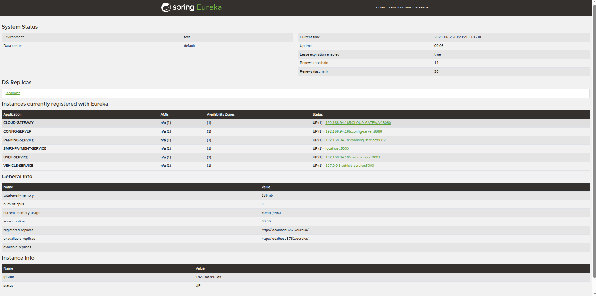

# Project Overview

This project is a microservices-based application built with **Java**, **Spring Boot**, and **Maven** for the backend, and **TypeScript** for the frontend. It also includes Python scripts managed with **pip** for auxiliary tasks.

## Features

- Service discovery using Eureka
- RESTful APIs
- Frontend written in TypeScript
- Python utilities for data processing
- JWT-based security for backend APIs

## Resources

- [Postman Collection](./postman_collection.json) for API testing
-  - Example of the Eureka service registry dashboard

## Getting Started

1. **Backend**:  
   Navigate to the backend directory and run:
   ```bash
   mvn spring-boot:run

2. **Frontend**:  
   Navigate to the frontend directory and run:
   ```bash
   npm install
   npm start
   
3. **Python Utilities**:  
   Navigate to the `python` directory and run:
   ```bash
   pip install -r requirements.txt
   python main.py

## Documentation **
- API documentation is available in the Postman collection.
- See /docs for architecture diagrams and additional screenshots.
- The backend uses JWT authentication for securing RESTful endpoints. To access protected endpoints, include a valid JWT token in the `Authorization` header as `Bearer <token>`. See the Postman collection for example requests.
